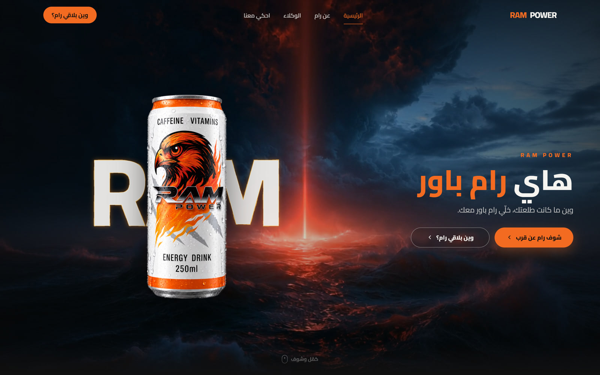
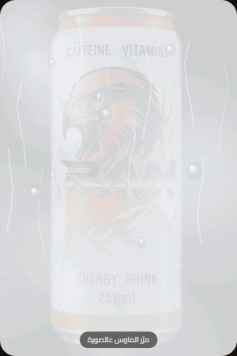
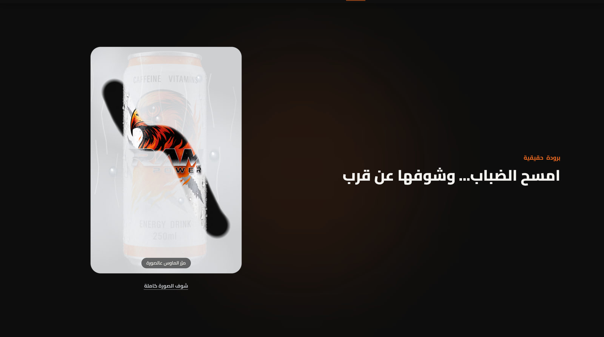
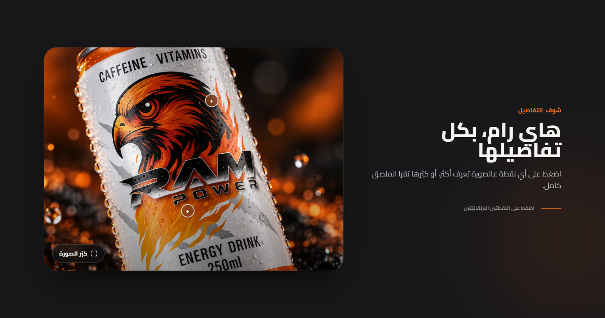
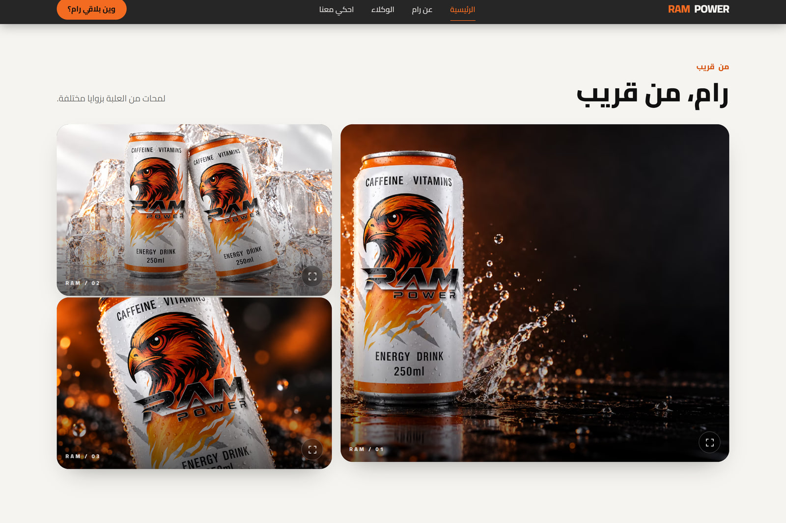
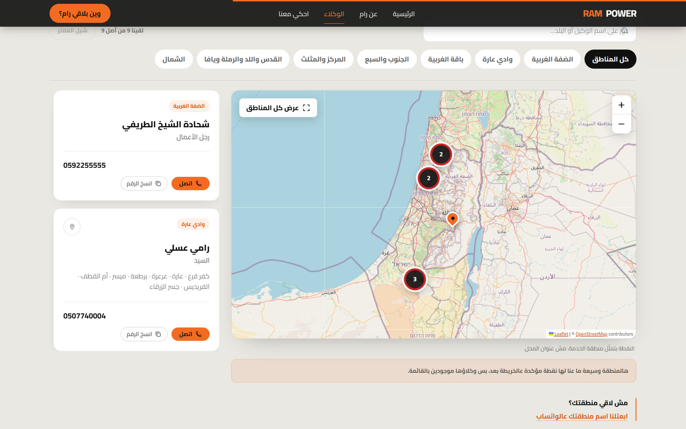
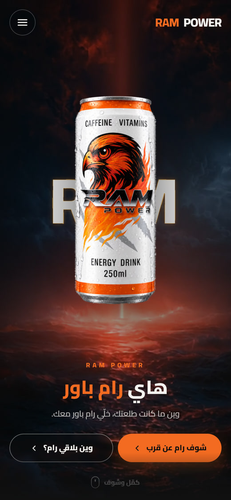
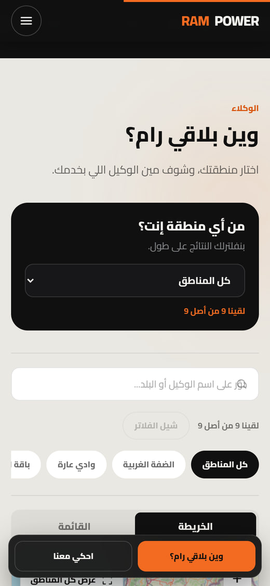

<div align="center" dir="rtl">



# RAM POWER

**موقع إعلاني تفاعلي بالعربية لمشروب الطاقة رام باور** — عرض المنتج عن قرب، وتجارب تفاعلية خفيفة، ودليل وكلاء بخريطة تفاعلية توصل الزائر لأقرب وكيل يخدم منطقته.

<br>


<br>

### [🌐 الموقع المباشر](https://ram-power.vercel.app) · [📸 جولة بالصور](#gallery) · [▶️ التشغيل محليًا](#run)

</div>

<div dir="rtl">

---

## الفهرس

- [نبذة عن المشروع](#about)
- [جولة بالصور](#gallery)
- [أبرز المميزات](#features)
- [التقنيات المستخدمة](#stack)
- [التشغيل محليًا](#run)
- [تخصيص المشروع](#customize)
- [تنظيم المشروع](#structure)
- [ملاحظات التنفيذ](#notes)
- [صاحب المشروع والحقوق](#credits)

<a id="about"></a>

## ✦ نبذة عن المشروع

موقع صفحة واحدة (single page) يعرّف بمشروب الطاقة **رام باور**، مبني بالكامل بالعربية وباتجاه RTL، وموجّه لزائر يدخل غالبًا من هاتفه.

الموقع يجمع ثلاثة أشياء في رحلة واحدة متصلة:

- **يعرض المنتج**: مشهد افتتاحي بفيديو بحر وكلمة RAM كبيرة والعلبة أمامها، ثم أقسام تعرّف بالعبوة وتفاصيلها ومعرض صور قابل للتكبير.
- **يخلق تفاعلًا حقيقيًا**: تجارب صغيرة يلمسها الزائر بنفسه — يمسح الضباب عن العلبة الباردة، يضغط نقاط على صورة الملصق، ويتابع حركة مرتبطة بتمريره للصفحة.
- **يوصله للوكيل**: دليل وكلاء بالبحث والفلترة حسب المنطقة، وخريطة تفاعلية بنقاط مجمّعة، مع اتصال مباشر ونسخ للأرقام وتواصل عبر واتساب.

ما يميّز التجربة تقنيًا أن كل الحركة والتأثيرات مبنية بأدوات الويب القياسية — **SVG filters** و**Canvas 2D** و**GSAP** — بلا WebGL ولا نماذج ثلاثية الأبعاد ولا مكتبات ثقيلة. وكل حركة مستمرة تتوقف تلقائيًا خارج نطاق الرؤية وعند مغادرة التبويب، وتُستبدل بحالة ثابتة عند تفعيل `prefers-reduced-motion`. المحتوى نفسه يظهر افتراضيًا في HTML قبل أي JavaScript، فلا يعتمد ظهور النص على نجاح الحركة.

<a id="gallery"></a>

## 📸 جولة بالصور

### تجربة «امسح الضباب»

طبقة ضباب وقطرات فوق صورة العلبة الباردة، تُمسح بحركة الماوس أو بالإصبع. المسار المكشوف يبقى مكشوفًا، وعند تجاوز نصف المساحة يذوب باقي الضباب وتظهر الصورة كاملة.

<div align="center">



</div>

> إن لم يعمل التسجيل المتحرك عندك، هذه لقطة ثابتة لنفس التجربة أثناء المسح:



### عرض المنتج وتفاصيله





### خريطة الوكلاء



### تصميم الهاتف

<table>
<tr>
<td width="50%"></td>
<td width="50%"></td>
</tr>
</table>

<a id="features"></a>

## ⚡ أبرز المميزات

- **تجربة عربية أصيلة** — الصفحة كلها `lang="ar"` و`dir="rtl"`، بخط Cairo محمّل عبر `next/font`، ونصوص بلهجة فلسطينية قريبة من الناس مجمّعة في ملف واحد. ورابط «تخطي إلى المحتوى» أول عنصر في الصفحة لمستخدمي الكيبورد.

- **تصميم متجاوب من الهاتف للشاشة العريضة** — حجم كلمة RAM وارتفاع العلبة يُحسبان من قياس المساحة المتاحة فعليًا عبر `ResizeObserver` (عرضًا وارتفاعًا معًا)، فلا تتصادم العناصر على الشاشات القصيرة. وعلى الهاتف يظهر شريط إجراءات سريع للوكلاء والتواصل، يختفي تلقائيًا عند فتح لوحة المفاتيح وعند الوصول للتذييل حتى لا يعترض المحتوى.

- **مشهد افتتاحي بفيديو وحركة دخول متسلسلة** — فيديو بحر خلف كلمة RAM والعلبة، مع صورة `poster` ثابتة تظهر فورًا قبل تحميله. تسلسل دخول واحد يحرّك الكلمة ثم العلبة ثم العنوان والأزرار، ثم تتحرك الطبقات بسرعات مختلفة مع التمرير لإحساس بالعمق.

- **تأثير الحافة المضيئة حول RAM** — خيط ضوئي رفيع يتبع حدود الحروف الحقيقية (محيطها الخارجي وفراغاتها الداخلية)، مشتقّ تلقائيًا من شكل النص عبر SVG filters — `feMorphology` و`feTurbulence` و`feDisplacementMap` — فيبقى مطابقًا للحروف عند أي حجم شاشة وبعد تحميل الخط. والنص الأبيض في طبقة منفصلة بلا فلتر ليبقى حادًا ومقروءًا.

- **تجربة «امسح الضباب»** — طبقة Canvas 2D فوق صورة العلبة: فرشاة ناعمة تتبع الماوس أو الإصبع، تصل النقاط أثناء الحركة السريعة فيبقى المسار متصلًا، والمكشوف يبقى مكشوفًا. على شاشات اللمس يُفعَّل «وضع المسح» بزر صريح حتى لا يُحبس تمرير الصفحة، ومعه زر يكشف الصورة كاملة مباشرة لمن لا يريد المسح، وزر لإرجاع الضباب.

- **معرض صور وعارض مكبّر** — معرض بثلاث صور للعلبة، وصورة تفاصيل عليها نقاط تفاعلية تشرح ما هو مكتوب على العبوة. أي صورة تُفتح في عارض مكبّر مشترك يقفل تمرير الخلفية، ويحبس التركيز داخله، ويُغلق بمفتاح `Escape`، ويعيد التركيز للعنصر الذي فتحه.

- **دليل وكلاء وبحث حسب المنطقة** — بحث نصي فوري بالاسم أو البلد، وفلترة بالمناطق، مع عدّاد نتائج وحالة فارغة واضحة. واختيار المنطقة يُحفظ محليًا في المتصفح فيعود الزائر لنفس الفلترة في زيارته التالية.

- **خريطة وكلاء تفاعلية** — خريطة Leaflet ببلاطات OpenStreetMap (بلا مفتاح API ولا اشتراك)، مع تجميع النقاط المتقاربة في عناقيد، ولا تُحمَّل المكتبة ولا البلاطات إلا عند اقتراب القسم من الشاشة. النقاط تمثّل **مراكز مناطق خدمة** لا عناوين محلات، والموقع يذكر ذلك صراحة تحت الخريطة، والمناطق التي لا نقطة موثّقة لها يظهر لها تنويه بدل اختراع إحداثيات.

- **تواصل مباشر بلا احتكاك** — اتصال بضغطة، ونسخ للأرقام مع تأكيد مقروء لقارئات الشاشة (`aria-live`)، وتواصل عبر واتساب. ونموذج أصحاب المحلات يجمع اسم المحل والمنطقة ويفتح واتساب برسالة جاهزة — يرسلها صاحب المحل بنفسه. وزر المشاركة يستخدم واجهة المشاركة الأصلية في الهاتف ويعود لنسخ الرابط إن لم تتوفر.

- **أسئلة شائعة تعمل بلا JavaScript** — قسم الأسئلة مبني على عنصري `<details>`/`<summary>` الأصليين، فيفتح ويغلق ويُتنقّل فيه بالكيبورد حتى لو تعطّل أي سكربت.

- **احترام تقليل الحركة وتحميل خفيف للأصول** — كل حركة مستمرة تتوقف خارج نطاق الرؤية وعند إخفاء التبويب، وعند `prefers-reduced-motion: reduce` تُعرض الحالة الثابتة (صورة بدل الفيديو، حافة ثابتة بلا تموّج، ضباب يُمسح يدويًا بلا حركة قطرات). والصور تمرّ عبر `next/image` بصيغ AVIF/WebP وأحجام متعددة، والخط يُحمّل عبر `next/font` بـ `display: swap`.

<a id="stack"></a>

## 🛠️ التقنيات المستخدمة

| التقنية | استخدامها في المشروع |
| --- | --- |
| **Next.js 16** (App Router) | إطار العمل، التصيير الساكن للصفحة، وتحسين الصور عبر `next/image` |
| **React 18** | بناء الأقسام كمكوّنات مستقلة |
| **TypeScript 5** | أنواع صريحة لبيانات الوكلاء والمناطق وإعدادات التأثيرات |
| **Tailwind CSS 3** | نظام الألوان (برتقالي/أسود/لؤلؤي) والتخطيط المتجاوب |
| **GSAP 3 + ScrollTrigger** | تسلسل دخول الافتتاحية، كشف الأقسام، والحركة المرتبطة بالتمرير |
| **Leaflet 1.9 + MarkerCluster** | خريطة الوكلاء وتجميع النقاط المتقاربة |
| **OpenStreetMap** | بلاطات الخريطة (بلا مفتاح API)، مع إبقاء الإسناد ظاهرًا |
| **SVG Filters** | الحافة الضوئية المتموّجة حول حروف RAM |
| **Canvas 2D** | طبقة الضباب والقطرات وآلية المسح |
| **next/font (Cairo)** | تحميل الخط العربي محليًا مع الموقع |
| **sharp** | تحسين الصور أثناء البناء (أداة تطوير) |

<a id="run"></a>

## ▶️ التشغيل محليًا

**المتطلبات:** Node.js بإصدار ‎20.9‎ أو أحدث (أو 22+)، و`npm`. المشروع **لا يحتاج أي متغيرات بيئة** ولا مفاتيح API — خدمة الخرائط المستخدمة مجانية وبلا اشتراك.

**1. استنسخ المستودع:**

```bash
git clone https://github.com/salah-alstre/RAM-POWER.git
cd RAM-POWER
```

**2. ثبّت الحزم** (المشروع يستخدم `package-lock.json`، فـ`npm` هو مدير الحزم المطابق):

```bash
npm install
```

**3. شغّل وضع التطوير:**

```bash
npm run dev
```

ثم افتح `http://localhost:3000`.

**4. للبناء الإنتاجي وتشغيله:**

```bash
npm run build
npm run start
```

**5. لفحص الكود:**

```bash
npm run lint
```

<a id="customize"></a>

## 🎛️ تخصيص المشروع

كل ما يُعدَّل عادة موجود في ملفات بيانات وإعدادات مركزية، بلا حاجة للدخول في المكوّنات:

| ما تريد تغييره | المسار |
| --- | --- |
| نصوص الواجهة كاملة (عناوين، أوصاف، أزرار، رسائل) | `src/data/copy.ts` |
| حقائق المنتج (الحجم، الفئة) | `src/data/product.ts` |
| صور المنتج | `public/images/ram` |
| فيديو الافتتاحية | `public/videos` |
| صورة الفيديو الثابتة (poster) | `public/images/ram/ram-ocean-poster.jpg` |
| الألوان والخط وحدود التخطيط | `tailwind.config.ts` |
| بيانات الوكلاء (الاسم، المنطقة، المدن، الهاتف) | `src/data/agents.ts` |
| المناطق وإحداثياتها ومصدر كل إحداثي | `src/data/regions.ts` |
| مزوّد بلاطات الخريطة ومركزها ومستوى التقريب | `src/lib/mapConfig.ts` |
| أرقام التواصل ورقم واتساب وحسابات السوشال | `src/data/contact.ts` |
| روابط شريط التنقل | `src/data/nav.ts` |
| شدة الحافة الضوئية حول RAM (السماكة، التموّج، التوهج، السرعة) | `src/lib/fireConfig.ts` |
| أزمنة تسلسل دخول الافتتاحية | `src/lib/heroTiming.ts` |

**ملاحظة عن نقاط الخريطة:** الإحداثيات في `src/data/regions.ts` تمثّل **مركز منطقة الخدمة** (مركز بلدة معروفة داخل المنطقة)، وليست عنوان الوكيل أو محله. المناطق الواسعة غير المرتبطة بمكان محدد — مثل «الضفة الغربية» و«الشمال» — تُركت عمدًا بلا نقطة على الخريطة بدل اختراع إحداثي، ووكلاؤها يبقون كاملين في القائمة. كل إحداثي مرفق بمصدره وتاريخ التحقق منه في نفس الملف.

**عند تغيير صورة:** ضع الصورة الجديدة بنفس اسم الملف داخل `public/images/ram` وسيتولى Next.js توليد الصيغ والأحجام تلقائيًا عند البناء.

<a id="structure"></a>

## 📁 تنظيم المشروع

| المجلد | وظيفته |
| --- | --- |
| `src/app` | التخطيط العام، الصفحة الرئيسية، بيانات الميتا، والأنماط العامة |
| `src/components` | كل قسم من الصفحة كمكوّن مستقل (الافتتاحية، المنتج، الضباب، المعرض، الوكلاء، الخريطة، التواصل…) |
| `src/data` | البيانات والنصوص المركزية (وكلاء، مناطق، تواصل، منتج، تنقل، نصوص الواجهة) |
| `src/hooks` | خطافات مشتركة: بوابة الحركة، الكشف عند التمرير، حبس التركيز، قفل التمرير، الحفظ المحلي |
| `src/lib` | إعدادات وأدوات: GSAP، الخريطة، تأثير الحافة، أزمنة الافتتاحية، معالجة الهواتف والنصوص |
| `public` | الصور والفيديو المخدومة كما هي |
| `docs/screenshots` | لقطات الموقع المستخدمة في هذا الملف |
| `references` | صور مرجعية للقراءة فقط (مصدر بيانات الوكلاء والسوشال) — لا تظهر في الموقع |

<a id="notes"></a>

## 📝 ملاحظات التنفيذ

جوانب رُوعيت أثناء البناء وجرى التحقق منها فعليًا في المتصفح:

- **إدارة الحركة وتنظيفها:** كل حركات GSAP معرَّفة داخل `gsap.context()` ويُستدعى `revert()` عند إزالة المكوّن، ومستمعو الأحداث وطلبات `requestAnimationFrame` تُلغى في دوال التنظيف. الحركة المستمرة تمر عبر بوابة واحدة تجمع `IntersectionObserver` + `visibilitychange` + `prefers-reduced-motion`.
- **تحميل الأصول والخريطة عند الحاجة:** مكتبة Leaflet وإضافة التجميع وبلاطات الخريطة لا تُحمَّل إلا عند اقتراب قسم الوكلاء من الشاشة، وفيديو الافتتاحية يتوقف خارج نطاق الرؤية.
- **دعم الهاتف واللمس:** تجربة المسح على اللمس تعمل بوضع صريح يُفعّله الزائر، فلا يُصادَر تمرير الصفحة، ومعها زر للخروج وزر لكشف الصورة كاملة. شريط الإجراءات السفلي يراعي `safe-area` ويختفي عند ظهور لوحة المفاتيح.
- **الوصول بالكيبورد وتقليل الحركة:** رابط تخطٍّ للمحتوى، حلقات تركيز ظاهرة (`focus-visible`)، عارض الصور يحبس التركيز ويستجيب لـ`Escape` ويعيد التركيز لمصدره، والأسئلة الشائعة تعمل بعناصر HTML أصلية. عند `prefers-reduced-motion: reduce` تتحول التأثيرات لحالات ثابتة مع بقاء كل المحتوى والوظائف متاحة.

هذه ملاحظات عن أسلوب التنفيذ ونتائج فحص يدوي في المتصفح — لا يوجد في المستودع قياس Lighthouse منشور ولا اختبارات آلية ولا تغطية اختبارات.

<a id="credits"></a>

## 👤 صاحب المشروع والحقوق

**تطوير وتصميم الموقع:** [salah-alstre](https://github.com/salah-alstre) · بالتعاون مع استوديو [XENON WEBS](https://www.xenon-webs.com/) في الواجهة والبرمجة

**علامة RAM POWER:** الاسم والشعار وصور المنتج مملوكة لأصحاب العلامة التجارية، ومستخدمة هنا لعرض المنتج والتعريف به. ملكية العلامة وصورها منفصلة تمامًا عن ملكية كود الموقع.

**الترخيص:** لا يوجد ملف ترخيص في هذا المستودع حتى الآن، وبالتالي لا يُمنح إذن عام بإعادة الاستخدام أو النشر. لأي استخدام خارج المستودع، راجع صاحب المشروع.

</div>
